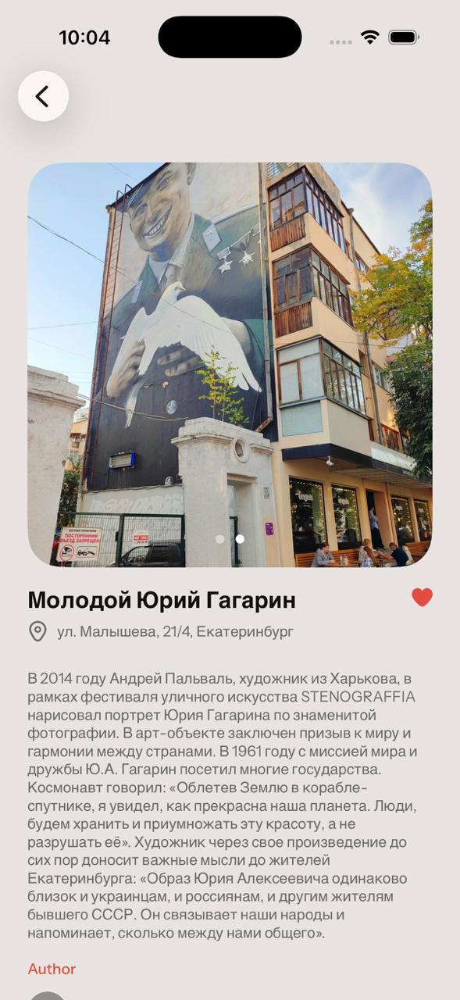
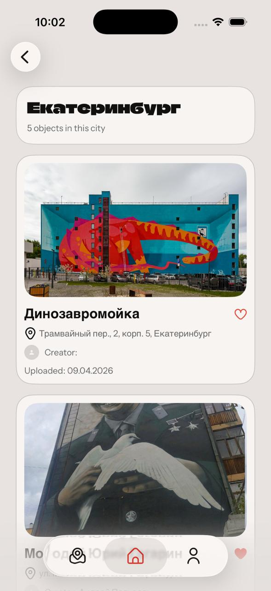

# Sprayd

Sprayd is an iOS app for discovering and posting street art: users can browse objects on a map and in a feed, open artwork detail cards, mark places as visited, add their own findings, and manage their profile.

This repository contains two parts:
- `Sprayd` — iOS client (SwiftUI, SwiftData, MapKit)
- `SpraydBackend` — API built with Vapor + PostgreSQL

---

## Core Features

- Onboarding and authentication: sign in, sign up, and guest mode
- Map with clustering and artwork preview cards
- Feed with `Featured`, `Cities`, and `Discover` sections
- Search across artworks (name/description)
- Artwork details with actions:
  - mark as `visited`
  - `contribute` (add photos)
- User profile:
  - edit username and bio
  - change avatar (camera/photo library)
  - `Posted / Visited / Favourites` sections
- Create new artwork entries:
  - photos
  - title and description
  - author, category, location
- Local persistence and sync via SwiftData
- iOS CI pipeline for build and tests (GitHub Actions)

---

## Screenshots

> Replace paths with real image assets and add files to the repository (for example in `docs/screenshots/`).

### Art Object


### Map


### Feed


### Add Art


---

## Tech Stack

### iOS (`Sprayd`)
- Swift, SwiftUI
- SwiftData
- MapKit + UIKit bridge for map rendering
- CoreLocation
- TipKit
- Keychain (`keychain-swift`) for token storage
- Architecture: Coordinators + Assemblies + ViewModel layer

---

## Project Structure

```text
Sprayd/                 # iOS app
├── Sprayd/
│   ├── App/
│   ├── Screens/
│   ├── Infrastructure/
│   ├── Core/
│   └── Presentation/
├── .github/workflows/ci.yml
└── Sprayd.xcodeproj